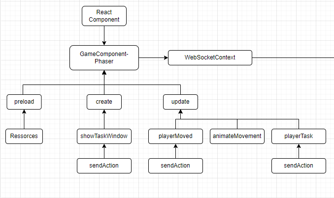

# Emulator Among Us Frontend
This is the Front end of Emulator Among Us.    
[Repository in GitHub here](https://github.com/JffMv/Emulator-Among-Us-Front)

## Getting Started

For clone this repository you use this command:
 ```
 git clone https://github.com/JffMv/Emulator-Among-Us-Front.git
 ```

### Prerequisites

Have installed:

git 2.44 - [Install Git](https://git-scm.com/book/en/v2/Getting-Started-Installing-Git)

node.js 22.5.1 - [Install Node.js](https://nodejs.org/en/download/package-manager/current)

Back-End - [Clone repository](https://github.com/JffMv/Emulator-Among-Us-Back)


## Deployment

The process were building project React with the command:

```
npm install
```

Then run the project with:

```
npm start
```
This project run for the port **3000**, so can see work http://localhost:3000


If you want add this project into backend java use this command and copy the directory **"build"** in the path /src/resource/ and change the name to **"public"**:
```
npm run build
```
This project run for the port **8080**, so can see work http://localhost:8080

## Architecture



### React Component: 
This application based in React and support for one component. Have two screens initials and the call component of phaser
and WebSocketContext contain component phaser.

### Phaser:
Phaser is the framework speciality in video games for app webs, where tools offer are efficient.
The implementation functions adds are: 
- showTaskWindow: Control show tasks.
- playerMoved: Control move the players.
- animateMovement: Allow run or stop the animation the player.
- playerTask: return if the task done. 

### WebSocketContext:
This connects, send, close and control of errors with the connection server for Endpoint [ws:domain/play](#).


## Built With

* [Javascript](https://developer.mozilla.org/en-US/docs/Web/JavaScript) - The language used
* [React](https://reactjs.org/) - Frontend framework
* [Node.js](https://nodejs.org/en) - Support of Frontend framework
* [Git](http://git-scm.com/) - Version Control System


## Authors

* **Yeferson Mesa**

## License

This project is licensed under the MIT License - see the [LICENCE.txt](LICENCE.txt) file for details